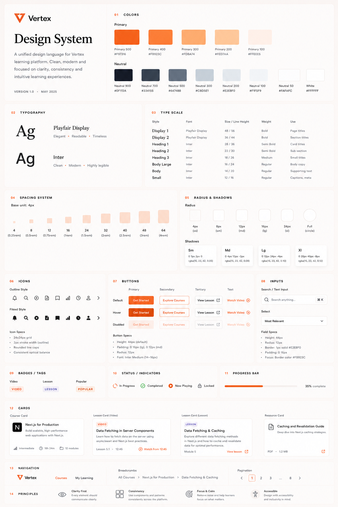

# Vertex LMS

Vertex is an AI-powered, modern Learning Management System (LMS) engineered for clarity, consistency, and intuitive learning experiences.



---

## 🚀 Key Features

- **Foundational Design System**: Tailored color palette, type scales, spacing system, radius & shadow design tokens built with Tailwind CSS v4.
- **Component Library**: Fully typed, accessible, and reusable React components:
  - `Button`, `Badge`, `StatusIndicator`, `ProgressBar`, `SearchInput`, `Select`, `Card`, `Logo`.
- **Domain Cards**:
  - `CourseCard`: Displaying course title, description, level, duration, and module counts.
  - `LessonVideoCard`: Lesson video details with timestamp and "Watch from" action.
  - `LessonCard`: Standard lesson topic breakdown.
  - `ResourceCard`: File download links and resource attachments.
- **Navigation Suite**: Responsive `Navbar`, `Breadcrumbs`, and `Pagination`.
- **Interactive Showcase**: Dedicated `/design-system` page displaying all 14 design specification sections for visual regression testing and component preview.

---

## 🛠️ Tech Stack

- **Framework**: [Next.js 16](https://nextjs.org/) (App Router)
- **UI & Logic**: [React 19](https://react.dev/), [TypeScript](https://www.typescriptlang.org/)
- **Styling**: [Tailwind CSS v4](https://tailwindcss.com/)
- **Fonts**: [Inter](https://fonts.google.com/specimen/Inter) (sans-serif) & [Playfair Display](https://fonts.google.com/specimen/Playfair+Display) (serif)
- **Icons**: [Lucide React](https://lucide.dev/)

---

## 📦 Getting Started

### Prerequisites

- Node.js 18.x or later
- npm or yarn

### Installation

1. Clone the repository:
   ```bash
   git clone https://github.com/VirajB7/VertexLMS.git
   cd VertexLMS
   ```

2. Install dependencies:
   ```bash
   npm install
   ```

3. Run the development server:
   ```bash
   npm run dev
   ```

4. Open [http://localhost:3000](http://localhost:3000) in your browser.
   - Navigate to [http://localhost:3000/design-system](http://localhost:3000/design-system) to view the design system showcase.

---

## 📁 Project Structure

```
├── app/
│   ├── design-system/    # Design system showcase page (/design-system)
│   ├── globals.css       # Design tokens & Tailwind v4 theme setup
│   ├── layout.tsx        # Root layout & Google Fonts configuration
│   └── page.tsx          # Main entry page
├── components/
│   ├── brand/            # Vertex Logo & branding
│   ├── cards/            # Course, Lesson & Resource domain cards
│   ├── nav/              # Navbar, Breadcrumbs & Pagination
│   └── ui/               # Core UI primitive components (Button, Badge, etc.)
├── lib/
│   └── utils.ts          # Classname helper (cn utility)
└── public/               # Static assets & public files
```

---

## 📜 License

This project is open source and available under the [MIT License](LICENSE).
